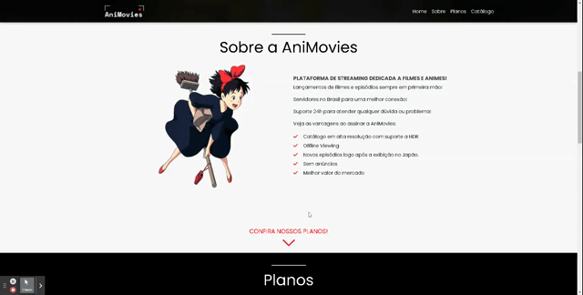
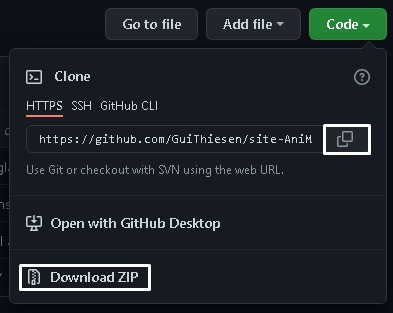

<h1 align="center">

</h1>

# 📖 Sobre a AniMovies


### A AniMovies é um projeto que foi desenvolvido para o processo de capacitação da [empresa júnior byron.solutions](https://www.byronsolutions.com/). A proposta é uma plataforma fictícia para streaming de filmes e animes.

<br>

# 💻 Tecnologias utilizadas

- ## [Javascript](https://www.javascript.com/)

- ## [HTML](https://developer.mozilla.org/pt-BR/docs/Web/HTML)

- ## [CSS](https://developer.mozilla.org/pt-BR/docs/Web/CSS)

- ## [Bootstrap](https://getbootstrap.com/)

- ## [Font Awesome](https://fontawesome.com/)

- ## [JQuery](https://jquery.com/)


# ⚙ Seções do Website


## Nav e Home


### Essa seção contém a Navbar e o carousel principal. Na Navbar há o logo do site e os os itens de navegação, que ao serem ativados proporcionam uma animação que os leva para a seção selecionada. No carousel é onde são mostrados alguns itens do catálogo, e, de 5 em 5 segundos, há uma transição que troca de item. Na estrela ao lado da nota, há um link que leva para uma página informativa sobre a obra.
<br>


<h1 align="center">

</h1>

## Sobre e Planos


### Nessa seção são apresentadas informações sobre os serviços da plataforma e suas vantagens. Ao clicar na seta indicadora, o usuário é levado para uma seção com os planos do serviço.

<br>

<h1 align="center">

</h1>

## Catálogo


### No catálogo são encontrados alguns itens hipoteticamente disponíveis no serviço de streaming. Também há um filtro que separa o catálogo em "Todos", apenas "Animes" e apenas "Filmes". Nos itens também há um Modal que leva a um trailer de cada obra.

<br>

<h1 align="center">

</h1>


# 📲 Como fazer download do projeto

### Para baixar o projeto, basta clonar o repositório, copiando-o no botão ao lado da URL e utilizar o comando git clone no Git Bash.

<br>

```bash

git clone https://github.com/GuiThiesen/site-AniMovies

```

### Você pode também apenas clicar no botão de download que fica logo abaixo e selecionar uma pasta para alocar o repositório.

<br>


<br>

 # Projeto desenvolvido por [Guilherme Thiesen](https://github.com/GuiThiesen) e [João Lucas](https://github.com/JoaoLucasLD) 
